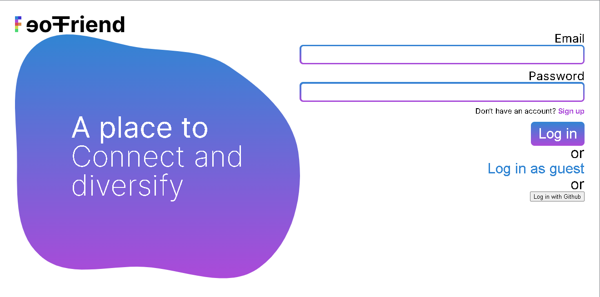

# chat-app - My chat website for people to chat

## Table of contents

- [Overview](#overview)
  - [Moltivation](#moltivation)
  - [Screenshot](#screenshot)
  - [Links](#links)
- [My process](#my-process)
  - [Built with](#built-with)
  - [What I learned](#what-i-learned)
  - [Continued development](#continued-development)
  - [Useful resources](#useful-resources)
- [Run my source code locally](#run-my-source-code-locally)
- [Author](#author)
- [My recent works](#my-recent-works)
- [Acknowledgments](#acknowledgments)

## Overview

### Motivation

- As a front-end dev, this project is a really good way to learn Firebase and ReactJS.
- Another reason is that I want to make a practical project.

### Screenshot

Desktop screenshot:


### Links

- Source URL: [See my source code](https://github.com/Binh2/chat-app)
- Live Site URL: [Visit my live site](https://chat-app-binh2.vercel.app/)

## My process

### Built with

- HTML
- CSS
- Typescript
- ReactJS + NextJS
- Firebase (version 9 - modular)

### What I learned

```js
// Firebase: Subscribe to a collection
const userCollectionRef = collection(getFirestore(), "users");
unsubscribeFunction = onSnapshot(query(userCollectionRef, where("id", "==", searchText), 
  orderBy("id"),
  limit(number_of_user)).withConverter(userTypeConverter), handleSnapshot
);
```

### Continued development

If I were to continue working on this project, I would try to:

- Add an ability to block people.
- See the newest message from a friend or group.
- Order friends and groups by the newest message's date.
- A better way to connect to other people
- Offline cache.

### Useful resources

- [ReactJS](https://reactjs.org/) - This helped me with basic concepts like custom hooks, context, and using hooks,...
- [NextJS](https://nextjs.org/) - This help me with basic layout of the project; basic NextJS elements like `<Image>`, `<Head>`;...
- [Firebase](https://firebase.google.com/docs) - This helped me learn Firebase v9 and migrate Firebase v8 to v9 because most of the tutorial on Firebase is outdated.
- [Firebase authentication in NextJS](https://blog.logrocket.com/implementing-authentication-in-next-js-with-firebase/) - This helped me a lot because I was stuck and don't know how to fix an error "auth user is null when got redirect". Turn out I just need to put the initializeApp from firebaseApp at the _app.tsx file

## Run my source code locally

### Clone my project to your local machine

`git clone https://github.com/Binh2/chat-app.git`

### Project setup (Download JS dependencies)

`yarn install` or `yarn`

### Compiles and hot-reloads for development

`yarn dev`

## Author

- Frontend Mentor - [@Binh2](https://www.frontendmentor.io/profile/Binh2)
- Twitter - [@hgqbinh2002](https://twitter.com/hgqbinh2002)
- LinkedIn - [hgqbinh2002](https://www.linkedin.com/in/hgqbinh2002/)

## My recent works

### My portfolio

- Source URL: [See my source code](https://github.com/Binh2/portfolio/)
- Live Site URL: [Visit my live site](https://portfolio-binh2.vercel.app)

### A blog template

- The source code: [Checkout my source code](https://github.com/Binh2/brother-blog)
- Live Site URL: [My live webpage](https://binh2.github.io/brother-blog/)

### Multi-step form

- Solution URL: [My GitHub multi-step-form repo](https://github.com/Binh2/multi-step-form/)
- Live Site URL: [Visit my live site](https://binh2.github.io/multi-step-form/)

## Acknowledgments

- Big thanks to this webpage [45 React projects order from easy to hard](https://contactmentor.com/best-react-projects-for-beginners-easy/) for giving me the idea to make this project
- Big thanks to myself for completing this project (pretty lonely, yes)

